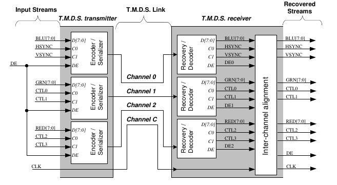

_Here I'll describe the principle of working of the HDMI (and also DVI)
video interface. To read a more specific description that also describes
non-essential things, see the [HDMI specifications][hdmispec] and
[DVI specifications][dvispec]_

--------------------------------------------------------------------------------

The HDMI is a digital interface to transmit video and audio to a screen.
It manages to do so by using a protocol called TMDS (Transition Minimized
Differential Signaling).

HDMI and DVI (single link) are very similar: in fact, an adapter between the two
is relatively cheap due to the fact that only a rewiring is needed.  
Also, the HDMI when turning on supposes a DVI interface is actually connected
to the interface.

From now on I will therefore describe characteristics that are common to both
and differentiate only when necessary.

A common trait of all these video-transmitting protocol is the *horizontal
blanking* and *vertical blanking time*: basically, the actual video screen image
is "surrounded" to the left and on the top by *fake pixels* (**not** part of
the image) which purpose is leave enough time for the old CRT screens' beam
to go to the start of the next line (or to go to the top of the screen when a
complete frame has been trasferred).  
**This time slice is used also by the screen to sync with the source.**

## TMDS (Transition-Minimized Differential Signaling)


The video signal is transferred over 3 _TMDS_ channels (one per color component,
R-G-B)

On an additional wire pair the so-called pixel-clock is transmitted.  
For each period of this clock, a pixel (real or "fake") is trasmitted.

Each TMDS channel has one byte (not really, but let's think like this for a
moment) in input (a color component) and spits out 10 bit, one at a time
(possibly in order).  
This means that, _while the pixel clock transition from '0' to '1' happens_
(a period has passed) _10 bits of data should have been transmitted_.  
By this, we understand that **the actual transmission frequency is 10 times
higher than the pixel frequency**

Each TDMS channel can therefore be composed of two parts: an *encoder* that
performs the 8bit/10bit conversion, and a *serializer* that takes the 10 bits
and put them on a wire one at a time.

The algorithm that is used by the encoder to determine the 10-bit sequence
can be found on the [DVI specification][divspec] at page 29/76.

TMDS is designed to have more bits in output than in input to perform some
error detection and to have more combinations to generate also numbers
that tells the screen when the line (frame) has finished transmitting and
do the horizontal (vertical) blanking.  
(if we had only 8 bits, how do we tell the screen _"data has finished,
prepare for the next line"_ ?)

### CONTROL SIGNALS
For the screen to understand what is the resolution we're transmitting in, some
special characters have to be transmitted during the blanking periods
(called *control signals*).
This control signals are designed to have a very high number of transition
and so help the screen be in sync with the source.

Each channel has actually another 2 inputs that tells the encoder which of the
4 possible control signals to generate during the blanking.

On both DVI and HDMI the Blue channel uses these 2 signals as horizontal
blanking and vertical blanking.

The other 4 control signals should be kept low on the DVI interface.  
On HDMI, these signals have another purpose (other than synchronization) also
to tell the screen what type of data is incoming (data, for instance audio,
or video)

## PHYSICAL INTERFACE
On the physical cable the link is built using 2 wires per signal we previously
saw: so the "main" wires are 8: R, G, B, and pixel clock

That is because the signal is *differential*: for each signal, we transmit its
value and also its negated value in pair.

This can be done on the VHDL by using the OBUFDS component present in the
xilinx library

## GET SOMETHING ON THE SCREEN
As I said before, the HDMI assumes -when fired up- a DVI interface is being
used.

The DVI interface when just turned on can only assume a pretty old, surpassed
and pixel-prone resolution is available: 640x480 @60Hz with
pixel clock = 25.175MHz and horizontal frequency of 31.5KHz
([DVI spec.][dvispec], section 2.2.4.2)

60Hz is the *refresh rate*: the frequency at which a complete screen is
transmitted (that means that every 1/60 seconds we transmit a frame of video).

The standard VGA resolution has 160 columns of horizontal blanking and 45 rows
of vertical blanking.  
This translates to an actual resolution of 800x525.

<!--
The algorithm in pseudo-code to transmit on the HDMI is then
```
hsync
for (45 times)
	
```
-->


--------------------------------------------------------------------------------
[hdmispec]: https://www.hdmi.org/manufacturer/specification.aspx
	"HDMI 1.3a specifications"
[dvispec]: https://web.archive.org/web/20120717013308/http://www.ddwg.org/lib/dvi_10.pdf
	"DVI 1.0 specifications on web.archive"
